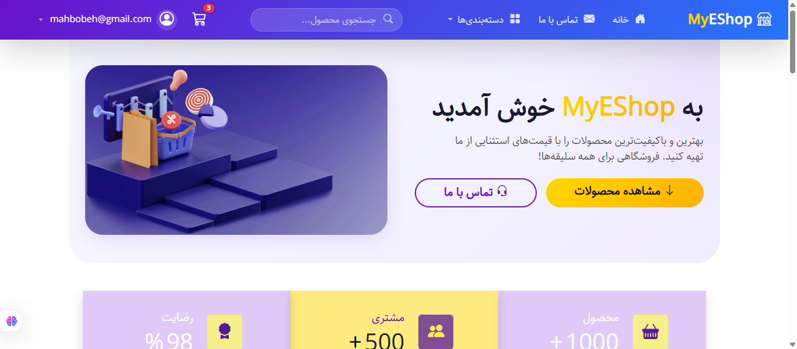
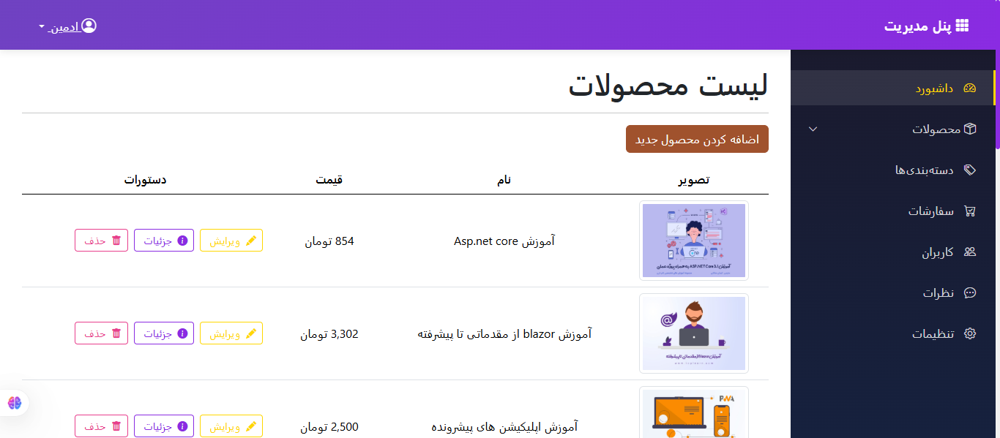
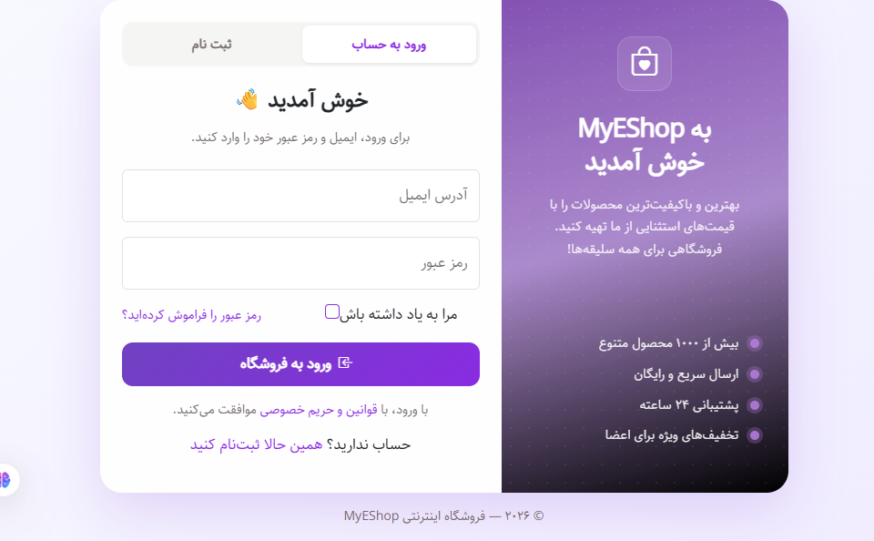
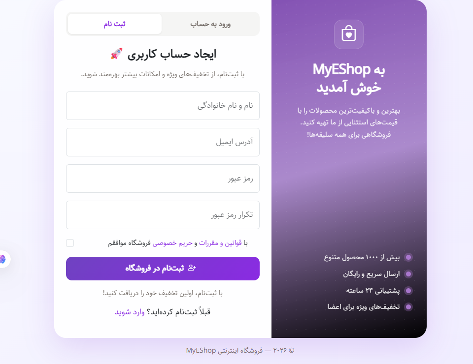

<div align="center">
  <div align="center">
  
</div>

  <h1>🛍️ MyEShop</h1>
  <h3>✨ Complete E-Commerce Store with ASP.NET Core 8 + Bootstrap 5 ✨</h3>

  <p>
    <a href="https://rita00st.github.io/MyEShop/"></a>
    <a href="https://github.com/rita00st/MyEShop"></a>
    <a href="https://github.com/rita00st/MyEShop/issues"></a>
    <a href="https://github.com/rita00st/MyEShop/blob/main/LICENSE"></a>
  </p>

  <p>
    
    
    
    
    
    
    
  </p>

  <hr>
</div>

---
<details> <summary><b> English –  Click to expand</b></summary>
  
## 📖 About the Project

**MyEShop** is a complete and professional e-commerce platform built with **ASP.NET Core 8** and **Entity Framework Core**. It features a **powerful backend** with product management, shopping cart, online payment, and an admin panel, paired with a **modern frontend** featuring responsive login and registration pages.

---

### 🎯 Why I Built This Project?

- 🚀 To deeply learn **ASP.NET Core MVC** and **Razor Pages**
- 💳 To understand **online payment gateways** (ZarinPal)
- 📊 To practice **database design** with **EF Core Code-First**
- 🎨 To implement **responsive design** with **Bootstrap 5**
- 🛡️ To manage **authentication** and **user roles**

---

## ✨ Key Features

| Section | Features |
|---------|----------|
| **🔐 Authentication** | User registration and login with **Cookie Authentication**, **User** and **Admin** roles |
| **📦 Product Management** | Add, edit, delete, and display products with **categories** and **image upload** |
| **🛒 Shopping Cart** | Add products, update quantities, remove items, automatic price calculation |
| **💳 Online Payment** | Integration with **ZarinPal** payment gateway (easily replaceable) |
| **👑 Admin Panel** | Full management of products, categories, orders, and users |
| **📱 Responsive Design** | Perfect display on **mobile, tablet, and desktop** |
| **🖼️ Image Preview** | Real-time image upload and preview for products |
| **🔍 Advanced Validation** | Password strength check, password matching, email format validation |

---

## 🛠️ Technologies Used

<details>
<summary><b>📌 Backend – Click to expand</b></summary>

| Technology | Description |
|-----------|-------------|
| **ASP.NET Core 8** | Main framework (MVC + Razor Pages) |
| **Entity Framework Core 8** | ORM with Code-First approach |
| **SQL Server** | Database |
| **AutoMapper** | Entity to ViewModel mapping |
| **Cookie Authentication** | Cookie-based authentication system |
| **ZarinPal** | Online payment gateway |
| **Dependency Injection** | IoC pattern |
| **IWebHostEnvironment** | Static file and upload management |
| **DataAnnotations** | Server-side validation |
</details>

<details>
<summary><b>🎨 Frontend – Click to expand</b></summary>

| Technology | Description |
|-----------|-------------|
| **HTML5** | Page structure |
| **CSS3** | Custom styling |
| **Bootstrap 5.3** | Responsive design and components |
| **Bootstrap Icons** | Icon library |
| **JavaScript (Vanilla)** | Validation, image preview, cart management |
| **SweetAlert2** | Beautiful alert messages |
</details>

---

## 🚀 Installation & Setup

### 📦 Prerequisites

- [.NET 8 SDK](https://dotnet.microsoft.com/download/dotnet/8.0)
- [SQL Server](https://www.microsoft.com/en-us/sql-server/sql-server-downloads) (or SQL Server Express)
- [Visual Studio 2022](https://visualstudio.microsoft.com/) or [VS Code](https://code.visualstudio.com/)

### ⚙️ Setup Steps

#### 1. Clone the repository
```bash
git clone https://github.com/rita00st/MyEShop.git
cd MyEShop
```

#### 2. Configure database connection
Edit `appsettings.json`:
```json
"ConnectionStrings": {
  "MyConnection": "Server=YOUR_SERVER;Database=EshopCore_DB;Trusted_Connection=True;TrustServerCertificate=True;"
}
```

#### 3. Apply migrations
```bash
dotnet ef database update
```

#### 4. Run the project
```bash
dotnet run
```
Then navigate to **`https://localhost:7030`** (port may vary).

---

## 📸 Screenshots

<div align="center">
  <table>
    <tr>
      <td align="center"><b>🏠 Home Page</b></td>
      <td align="center"><b>📋 Admin Panel</b></td>
    </tr>
    <tr>
      <td></td>
      <td></td>
    </tr>
    <tr>
      <td align="center"><b>🔐 Login Page</b></td>
      <td align="center"><b>📝 Register Page</b></td>
    </tr>
    <tr>
      <td></td>
      <td></td>
    </tr>
  </table>
</div>


---

## 📂 Project Structure

```
MyEShop/
├── .gitattributes          # Git attributes configuration for line endings
├── .gitignore              # List of files Git should ignore (e.g., `bin/` and `obj/` folders)
├── MyEShop.sln             # Visual Studio Solution file
├── README.md               # Project documentation file (the page you're viewing)
│
├── MyEShop/                # 📁 Main project folder (source code)
│   ├── .config/            # Project configuration settings
│   ├── .github/            # GitHub Actions workflows and Issue templates
│   ├── Controllers/        # 🎮 MVC Controllers (request handlers)
│   ├── Models/             # 🗄️ Data models and ViewModels (includes Entities and DatabaseContext)
│   ├── Pages/              # 📄 Razor Pages (includes Admin Panel in `Pages/Admin/`)
│   ├── Views/              # 🖼️ MVC Views (UI in `Account/`, `Home/`, etc.)
│   ├── wwwroot/            # 🌐 Public static files (CSS, JS, images, etc.)
│   ├── Migrations/         # 📜 Entity Framework Core migration files
│   ├── Services/           # 💼 Application services and business logic
│   ├── Properties/         # Project launch settings (e.g., `launchSettings.json`)
│   ├── appsettings.json    # 🔧 Main application settings (database connection, keys)
│   ├── appsettings.Development.json # Development environment specific settings
│   └── Program.cs          # 🚀 Application entry point and startup configuration
│
└── screenshots/            # 🖼️ Project screenshots and images (for README)
```

---

## 🔧 Payment Gateway Configuration

To enable online payments, get your `MerchantId` from ZarinPal and add it to `appsettings.json`:

```json
"Zarinpal": {
  "MerchantId": "YOUR_MERCHANT_ID"
}
```

For testing in **Sandbox** environment, use `YOUR_MERCHANT_ID` and change the callback URL to `sandbox.zarinpal.com`.

---

## 🤝 Contributing

If you have suggestions or improvements, feel free to open an **Issue** or submit a **Pull Request**.

1. Fork the repository
2. Create a new branch (`git checkout -b feature/AmazingFeature`)
3. Commit your changes (`git commit -m 'Add some AmazingFeature'`)
4. Push to the branch (`git push origin feature/AmazingFeature`)
5. Open a Pull Request

---

## 📄 License

This project is licensed under the **MIT License**. See the [LICENSE](LICENSE) file for more details.

---

## 👨‍💻 Developer

<div align="center">
  <a href="https://github.com/rita00st">
    
  </a>
  <br>
  <h3>🌟 Mahbobeh Sadat Tabatabaeian</h3>

  [](https://github.com/rita00st)
  [](https://linkedin.com/in/mahbobehTabatabaeian)

  [](mailto:mahbobeh1383@gmail.com)
</div>

---

## ⭐ Support

If you find this project useful, please give it a **star (⭐)** on GitHub!

| Repository | Link | Status |
|------------|------|--------|
| **Backend (MyEShop)** | [https://github.com/rita00st/MyEShop](https://github.com/rita00st/MyEShop) | [](https://github.com/rita00st/MyEShop) |
| **Live Demo** | [https://rita00st.github.io/MyEShop/](https://rita00st.github.io/MyEShop/) | [](https://rita00st.github.io/MyEShop/) |

---

<div align="center">
  <p>
    <i>Made with ❤️ and ☕ in Iran</i>
  </p>
  <p>
    <i>«Write code, live beautifully, and help others.»</i>
  </p>
</div>
</details>
---

<details>
<summary><b>🇮🇷 فارسی (Persian) – کلیک کنید</b></summary>

<br>

<div dir="rtl" align="right">

## 📖 درباره پروژه

**MyEShop** یک فروشگاه اینترنتی کامل و حرفه‌ای است که با **ASP.NET Core 8** و **Entity Framework Core** ساخته شده است. این پروژه شامل یک **بک‌اند قدرتمند** با مدیریت محصولات، سبد خرید، پرداخت آنلاین و پنل مدیریت است و یک **فرانت‌اند مدرن** با صفحات ورود و ثبت‌نام واکنش‌گرا دارد.

### 🎯 چرا این پروژه را ساختم؟
- 🚀 برای یادگیری عمیق **ASP.NET Core MVC** و **Razor Pages**
- 💳 آشنایی با **درگاه‌های پرداخت آنلاین** (زرین‌پال)
- 📊 تمرین **طراحی پایگاه داده** با **EF Core Code-First**
- 🎨 پیاده‌سازی **طراحی واکنش‌گرا** با **Bootstrap 5**
- 🛡️ مدیریت **احراز هویت** و **نقش‌های کاربری**

---

## ✨ ویژگی‌های برجسته

| بخش | ویژگی‌ها |
|-----|----------|
| **🔐 احراز هویت** | ثبت‌نام و ورود کاربران با **Cookie Authentication**، نقش‌های **کاربر عادی** و **ادمین** |
| **📦 مدیریت محصولات** | افزودن، ویرایش، حذف و نمایش محصولات با **دسته‌بندی** و **آپلود تصویر** |
| **🛒 سبد خرید** | اضافه کردن محصول، تغییر تعداد، حذف آیتم، محاسبه خودکار قیمت |
| **💳 پرداخت آنلاین** | اتصال به **درگاه زرین‌پال** (قابل تغییر برای سایر درگاه‌ها) |
| **👑 پنل مدیریت** | مدیریت کامل محصولات، دسته‌بندی‌ها، سفارشات و کاربران |
| **📱 طراحی واکنش‌گرا** | نمایش عالی در **موبایل، تبلت و دسکتاپ** |
| **🖼️ پیش‌نمایش تصاویر** | آپلود و نمایش لحظه‌ای تصاویر محصولات |
| **🔍 اعتبارسنجی پیشرفته** | بررسی قدرت رمز عبور، تطابق رمزها، فرمت ایمیل |

---

## 🛠️ تکنولوژی‌های استفاده شده

<details>
<summary><b>📌 بک‌اند (Backend) – کلیک کنید</b></summary>

| تکنولوژی | توضیح |
|-----------|--------|
| **ASP.NET Core 8** | چارچوب اصلی (MVC + Razor Pages) |
| **Entity Framework Core 8** | ORM با رویکرد Code-First |
| **SQL Server** | پایگاه داده |
| **AutoMapper** | نگاشت بین Entity و ViewModel |
| **Cookie Authentication** | سیستم احراز هویت مبتنی بر کوکی |
| **ZarinPal** | درگاه پرداخت آنلاین |
| **Dependency Injection** | الگوی تزریق وابستگی |
| **IWebHostEnvironment** | مدیریت فایل‌های استاتیک و آپلود |
| **DataAnnotations** | اعتبارسنجی سمت سرور |
</details>

<details>
<summary><b>🎨 فرانت‌اند (Frontend) – کلیک کنید</b></summary>

| تکنولوژی | توضیح |
|-----------|--------|
| **HTML5** | ساختار صفحات |
| **CSS3** | استایل‌دهی سفارشی |
| **Bootstrap 5.3** | طراحی واکنش‌گرا و کامپوننت‌ها |
| **Bootstrap Icons** | مجموعه آیکون‌های زیبا |
| **JavaScript (Vanilla)** | اعتبارسنجی، پیش‌نمایش تصاویر، مدیریت سبد خرید |
| **SweetAlert2** | پیام‌های هشدار جذاب |
</details>

---

## 🚀 نصب و راه‌اندازی

### 📦 پیش‌نیازها
- [.NET 8 SDK](https://dotnet.microsoft.com/download/dotnet/8.0)
- [SQL Server](https://www.microsoft.com/en-us/sql-server/sql-server-downloads) (یا SQL Server Express)
- [Visual Studio 2022](https://visualstudio.microsoft.com/) یا [VS Code](https://code.visualstudio.com/)

### ⚙️ مراحل نصب

#### ۱. کلون کردن مخزن
```bash
git clone https://github.com/rita00st/MyEShop.git
cd MyEShop
```

#### ۲. تنظیم اتصال به دیتابیس
فایل `appsettings.json` را ویرایش کنید:
```json
"ConnectionStrings": {
  "MyConnection": "Server=YOUR_SERVER;Database=EshopCore_DB;Trusted_Connection=True;TrustServerCertificate=True;"
}
```

#### ۳. اعمال مایگریشن‌ها
```bash
dotnet ef database update
```

#### ۴. اجرای پروژه
```bash
dotnet run
```
سپس به آدرس **`https://localhost:7030`** بروید.

---

## 📸 پیش‌نمایش

<div align="center">
  <table>
    <tr>
      <td align="center"><b>🏠 صفحه اصلی</b></td>
      <td align="center"><b>📋 پنل مدیریت</b></td>
    </tr>
    <tr>
      <td></td>
      <td></td>
    </tr>
    <tr>
      <td align="center"><b>🔐 صفحه ورود</b></td>
      <td align="center"><b>📝 صفحه ثبت‌نام</b></td>
    </tr>
    <tr>
      <td></td>
      <td></td>
    </tr>
  </table>
</div>

---

## 📂 ساختار پروژه

```
MyEShop/
├── .gitattributes          # تنظیمات ویژگی‌های Git برای مدیریت خطوط
├── .gitignore              # لیست فایل‌هایی که Git نباید کند (مثل پوشه‌های `bin/` و `obj/`)
├── MyEShop.sln             # فایل Solution ویژوال استادیو
├── README.md               # فایل راهنمای پروژه (همین صفحه‌ای که می‌بینید)
│
├── MyEShop/                # 📁 پوشه‌ی اصلی پروژه (کدهای منبع)
│   ├── .config/            # تنظیمات پیکربندی پروژه
│   ├── .github/            # تنظیمات GitHub Actions و قالب‌های Issue
│   ├── Controllers/        # 🎮 کنترلرهای MVC (مدیریت درخواست‌ها)
│   ├── Models/             # 🗄️ مدل‌های داده و ViewModel (شامل Entities و DatabaseContext)
│   ├── Pages/              # 📄 صفحات Razor Pages (شامل پنل ادمین در `Pages/Admin/`)
│   ├── Views/              # 🖼️ Viewهای MVC (رابط کاربری در پوشه‌های `Account/`, `Home/`, ...)
│   ├── wwwroot/            # 🌐 فایل‌های استاتیک عمومی (CSS, JS, تصاویر، و...)
│   ├── Migrations/         # 📜 فایل‌های مایگریشن Entity Framework Core
│   ├── Services/           # 💼 سرویس‌های برنامه و منطق کسب‌وکار
│   ├── Properties/         # تنظیمات راه‌اندازی پروژه (مثل `launchSettings.json`)
│   ├── appsettings.json    # 🔧 تنظیمات اصلی برنامه (اتصال به دیتابیس، کلیدها)
│   ├── appsettings.Development.json # تنظیمات مخصوص محیط توسعه
│   └── Program.cs          # 🚀 نقطه‌ی ورود و راه‌اندازی برنامه
│
└── screenshots/            # 🖼️ تصاویر و اسکرین‌شات‌های پروژه (برای README)
```

---

## 🔧 تنظیمات درگاه پرداخت

برای فعال‌سازی پرداخت آنلاین، `MerchantId` خود را از زرین‌پال دریافت و در `appsettings.json` وارد کنید:

```json
"Zarinpal": {
  "MerchantId": "YOUR_MERCHANT_ID"
}
```

برای تست در محیط **Sandbox**، از `YOUR_MERCHANT_ID` استفاده کنید.

---

## 🤝 مشارکت در پروژه

اگر پیشنهاد، ایده یا بهبودی دارید، لطفاً یک **Issue** باز کنید یا **Pull Request** ارسال کنید.

---

## 📄 لایسنس

این پروژه تحت لایسنس **MIT** منتشر شده است.

---

## 👨‍💻 توسعه‌دهنده

<div align="center">
  <a href="https://github.com/rita00st">
    
  </a>
  <br>
  <h3>🌟 محبوبه سادات طباطبائیان</h3>

  [](https://github.com/rita00st)
  [](https://linkedin.com/in/mahbobehTabatabaeian)

  [](mailto:mahbobeh1383@gmail.com)
</div>

---

## ⭐ حمایت و تشکر

اگر این پروژه برای شما مفید بود، لطفاً یک **ستاره (⭐)** به مخزن‌های آن بدهید.

| مخزن | لینک | وضعیت |
|------|------|--------|
| **بک‌اند (MyEShop)** | [https://github.com/rita00st/MyEShop](https://github.com/rita00st/MyEShop) | [](https://github.com/rita00st/MyEShop) |
| **دموی زنده** | [https://rita00st.github.io/MyEShop/](https://rita00st.github.io/MyEShop/) | [](https://rita00st.github.io/MyEShop/) |

---

<div align="center">
  <p>
    <i>ساخته شده با ❤️ و ☕ در ایران</i>
  </p>
  <p>
    <i>«کد بنویسید، زیبا زندگی کنید، و به دیگران کمک کنید.»</i>
  </p>
</div>

</div>
</details>
```
