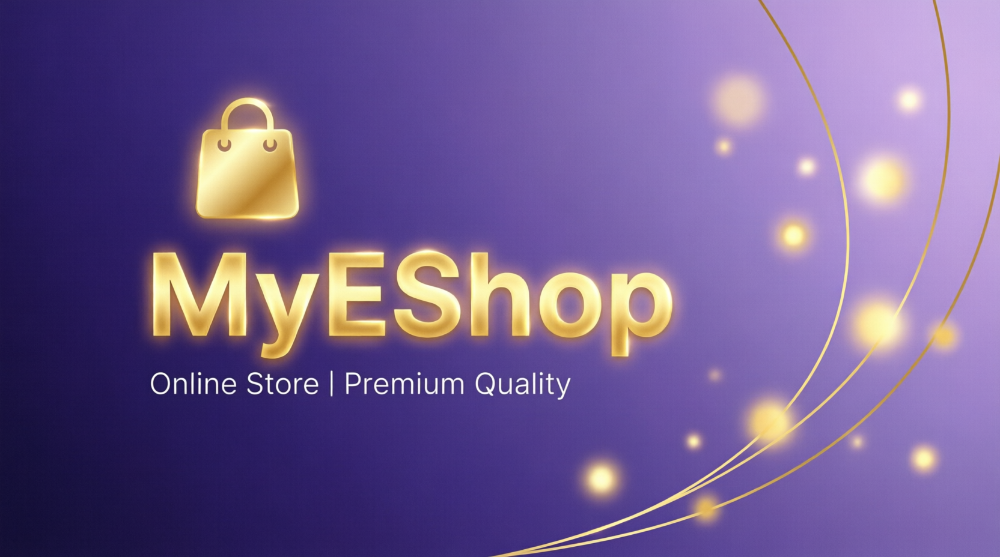

  

  

  
  <h1>🛍️ MyEShop</h1>
  
  <!-- Language Switcher with Hash Links -->
  

    <a href="#en" style="display:inline-block;padding:8px 20px;margin:5px;background:#007bff;color:white;text-decoration:none;border-radius:5px;font-weight:bold;">🇬🇧 English</a>
    <a href="#fa" style="display:inline-block;padding:8px 20px;margin:5px;background:#6c757d;color:white;text-decoration:none;border-radius:5px;font-weight:bold;">🇮🇷 فارسی</a>
  

  
  

    
    
    
    
  

  
  

    
    
    
    
    
  

  
  

<!-- English Section -->

<h2>📖 About the Project</h2>

<strong>MyEShop</strong> is a fully-featured, professional online store built with <strong>ASP.NET Core 8</strong> and <strong>Entity Framework Core</strong>. It includes a powerful backend with product management, shopping cart, online payment, and admin panel, along with a modern frontend with responsive login and registration pages.

<h3>🎯 Why I built this project?</h3>
<ul>
  <li>🚀 To deeply learn <strong>ASP.NET Core MVC</strong> &amp; <strong>Razor Pages</strong></li>
  <li>💳 To understand <strong>online payment gateways</strong> (ZarinPal)</li>
  <li>📊 To practice <strong>database design</strong> with <strong>EF Core Code-First</strong></li>
  <li>🎨 To implement <strong>responsive design</strong> with <strong>Bootstrap 5</strong></li>
  <li>🛡️ To handle <strong>authentication</strong> &amp; <strong>user roles</strong></li>
</ul>

<h2>✨ Key Features</h2>
<table>
  <tr><th>Section</th><th>Features</th></tr>
  <tr><td><strong>🔐 Authentication</strong></td><td>User registration &amp; login with <strong>Cookie Authentication</strong>, <strong>User</strong> &amp; <strong>Admin</strong> roles</td></tr>
  <tr><td><strong>📦 Product Management</strong></td><td>Add, edit, delete, and display products with <strong>categories</strong> &amp; <strong>image upload</strong></td></tr>
  <tr><td><strong>🛒 Shopping Cart</strong></td><td>Add items, update quantity, remove items, automatic price calculation</td></tr>
  <tr><td><strong>💳 Online Payment</strong></td><td>Integration with <strong>ZarinPal</strong> (easily replaceable with other gateways)</td></tr>
  <tr><td><strong>👑 Admin Panel</strong></td><td>Full management of products, categories, orders, and users</td></tr>
  <tr><td><strong>📱 Responsive Design</strong></td><td>Perfect display on <strong>mobile, tablet, and desktop</strong></td></tr>
</table>

<h2>🛠️ Technologies Used</h2>

  
<b>📌 Backend – Click to expand</b>

  <ul>
    <li><strong>ASP.NET Core 8</strong> – Main framework (MVC + Razor Pages)</li>
    <li><strong>Entity Framework Core 8</strong> – ORM with Code-First approach</li>
    <li><strong>SQL Server</strong> – Database</li>
    <li><strong>AutoMapper</strong> – Mapping between Entity and ViewModel</li>
    <li><strong>Cookie Authentication</strong> – Cookie-based authentication system</li>
    <li><strong>ZarinPal</strong> – Online payment gateway</li>
    <li><strong>Dependency Injection</strong> – Built-in IoC container</li>
    <li><strong>DataAnnotations</strong> – Server-side validation</li>
  </ul>

  
<b>🎨 Frontend – Click to expand</b>

  <ul>
    <li><strong>HTML5</strong> – Page structure</li>
    <li><strong>CSS3</strong> – Custom styling</li>
    <li><strong>Bootstrap 5.3</strong> – Responsive design &amp; components</li>
    <li><strong>Bootstrap Icons</strong> – Beautiful icon set</li>
    <li><strong>JavaScript (Vanilla)</strong> – Validation, image preview, cart management</li>
  </ul>

<h2>🚀 Installation &amp; Setup</h2>
<h3>📦 Prerequisites</h3>
<ul>
  <li><a href="https://dotnet.microsoft.com/download/dotnet/8.0">.NET 8 SDK</a></li>
  <li><a href="https://www.microsoft.com/en-us/sql-server/sql-server-downloads">SQL Server</a> (or SQL Server Express)</li>
  <li><a href="https://visualstudio.microsoft.com/">Visual Studio 2022</a> or <a href="https://code.visualstudio.com/">VS Code</a></li>
</ul>

<h3>⚙️ Steps</h3>
<ol>
  <li><strong>Clone the repository:</strong>
    <pre><code>git clone https://github.com/rita00st/MyEShop.git
cd MyEShop</code></pre>
  </li>
  <li><strong>Configure database connection</strong> in <code>appsettings.json</code>:
    <pre><code>"ConnectionStrings": {
  "MyConnection": "Server=YOUR_SERVER;Database=EshopCore_DB;Trusted_Connection=True;TrustServerCertificate=True;"
}</code></pre>
  </li>
  <li><strong>Apply migrations</strong> (create tables):
    <pre><code>dotnet ef database update</code></pre>
  </li>
  <li><strong>Run the project:</strong>
    <pre><code>dotnet run</code></pre>
    Then navigate to <strong><code>https://localhost:7030</code></strong> (port may vary; check terminal output).
  </li>
</ol>

<!-- Persian Section -->

  <h2>📖 درباره پروژه</h2>
  
<strong>MyEShop</strong> یک فروشگاه اینترنتی کامل و حرفه‌ای است که با <strong>ASP.NET Core 8</strong> و <strong>Entity Framework Core</strong> ساخته شده است. این پروژه شامل یک <strong>بک‌اند قدرتمند</strong> با مدیریت محصولات، سبد خرید، پرداخت آنلاین و پنل مدیریت است و یک <strong>فرانت‌اند مدرن</strong> با صفحات ورود و ثبت‌نام واکنش‌گرا دارد.

  <h3>🎯 چرا این پروژه را ساختم؟</h3>
  <ul>
    <li>🚀 برای یادگیری عمیق <strong>ASP.NET Core MVC</strong> و <strong>Razor Pages</strong></li>
    <li>💳 آشنایی با <strong>درگاه‌های پرداخت آنلاین</strong> (زرین‌پال)</li>
    <li>📊 تمرین <strong>طراحی پایگاه داده</strong> با <strong>EF Core Code-First</strong></li>
    <li>🎨 پیاده‌سازی <strong>طراحی واکنش‌گرا</strong> با <strong>Bootstrap 5</strong></li>
    <li>🛡️ مدیریت <strong>احراز هویت</strong> و <strong>نقش‌های کاربری</strong></li>
  </ul>

  <h2>✨ ویژگی‌های برجسته</h2>
  <table>
    <tr><th>بخش</th><th>ویژگی‌ها</th></tr>
    <tr><td><strong>🔐 احراز هویت</strong></td><td>ثبت‌نام و ورود کاربران با <strong>Cookie Authentication</strong>، نقش‌های <strong>کاربر عادی</strong> و <strong>ادمین</strong></td></tr>
    <tr><td><strong>📦 مدیریت محصولات</strong></td><td>افزودن، ویرایش، حذف و نمایش محصولات با <strong>دسته‌بندی</strong> و <strong>آپلود تصویر</strong></td></tr>
    <tr><td><strong>🛒 سبد خرید</strong></td><td>اضافه کردن محصول، تغییر تعداد، حذف آیتم، محاسبه خودکار قیمت</td></tr>
    <tr><td><strong>💳 پرداخت آنلاین</strong></td><td>اتصال به <strong>درگاه زرین‌پال</strong> (قابل تغییر برای سایر درگاه‌ها)</td></tr>
    <tr><td><strong>👑 پنل مدیریت</strong></td><td>مدیریت کامل محصولات، دسته‌بندی‌ها، سفارشات و کاربران</td></tr>
    <tr><td><strong>📱 طراحی واکنش‌گرا</strong></td><td>نمایش عالی در <strong>موبایل، تبلت و دسکتاپ</strong></td></tr>
  </table>

  <h2>🛠️ تکنولوژی‌های استفاده شده</h2>
  

    
<b>📌 بک‌اند – کلیک کنید</b>

    <ul>
      <li><strong>ASP.NET Core 8</strong> – چارچوب اصلی (MVC + Razor Pages)</li>
      <li><strong>Entity Framework Core 8</strong> – ORM با رویکرد Code-First</li>
      <li><strong>SQL Server</strong> – پایگاه داده</li>
      <li><strong>AutoMapper</strong> – نگاشت بین Entity و ViewModel</li>
      <li><strong>Cookie Authentication</strong> – سیستم احراز هویت مبتنی بر کوکی</li>
      <li><strong>ZarinPal</strong> – درگاه پرداخت آنلاین</li>
      <li><strong>Dependency Injection</strong> – الگوی تزریق وابستگی</li>
      <li><strong>DataAnnotations</strong> – اعتبارسنجی سمت سرور</li>
    </ul>
  

  

    
<b>🎨 فرانت‌اند – کلیک کنید</b>

    <ul>
      <li><strong>HTML5</strong> – ساختار صفحات</li>
      <li><strong>CSS3</strong> – استایل‌دهی سفارشی</li>
      <li><strong>Bootstrap 5.3</strong> – طراحی واکنش‌گرا و کامپوننت‌ها</li>
      <li><strong>Bootstrap Icons</strong> – مجموعه آیکون‌های زیبا</li>
      <li><strong>JavaScript (Vanilla)</strong> – اعتبارسنجی، پیش‌نمایش تصاویر، مدیریت سبد خرید</li>
    </ul>
  

  <h2 align="center">🚀 نصب و راه‌اندازی</h2>

 

<h3 align="right">📦 پیش‌نیازها</h3>

<ul dir="rtl" align="right" style="list-style-position: inside;">
  <li><a href="https://dotnet.microsoft.com/download/dotnet/8.0">.NET 8 SDK</a></li>
  <li><a href="https://www.microsoft.com/en-us/sql-server/sql-server-downloads">SQL Server</a> (یا SQL Server Express)</li>
  <li><a href="https://visualstudio.microsoft.com/">Visual Studio 2022</a> یا <a href="https://code.visualstudio.com/">VS Code</a></li>
</ul>

 

<h3 align="right">⚙️ مراحل نصب</h3>

<ol dir="rtl" align="right" style="list-style-position: inside;">

  <li>
    <strong>کلون کردن مخزن:</strong>
    

          <pre><code>git clone https://github.com/rita00st/MyEShop.git
cd MyEShop</code></pre>
    

  </li>

  <li>
    <strong>تنظیم اتصال به دیتابیس</strong> در فایل <code>appsettings.json</code>:
    

          <pre><code>"ConnectionStrings": {
  "MyConnection": "Server=YOUR_SERVER;Database=EshopCore_DB;Trusted_Connection=True;TrustServerCertificate=True;"
}</code></pre>
    

  </li>

  <li>
    <strong>اعمال مایگریشن‌ها</strong> (ساخت جداول):
    

       <pre><code>dotnet ef database update</code></pre>
    

  </li>

  <li>
    <strong>اجرای پروژه:</strong>
    

      <pre><code>dotnet run</code></pre>
    

  </li>

  <li>
    سپس به آدرس <strong><code>https://localhost:7030</code></strong> بروید. (پورت ممکن است متفاوت باشد، در خروجی ترمینال آن را ببینید.)
  </li>

</ol>
<!-- Rest of your content (screenshots, folder structure, license, etc.) goes here -->
<!-- Make sure to duplicate any section you want to be bilingual -->
